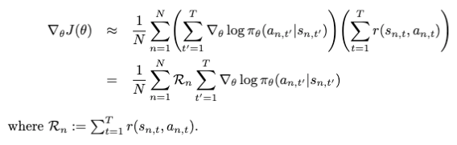
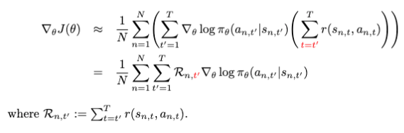
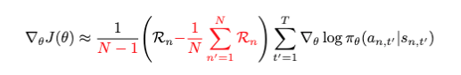
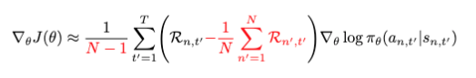

# REINFORCE
A simple REINFORCE algorithm implementation in PyTorch.

## Features

- **Simple**: Core REINFORCE implementations is <100 lines (See [reinforce.py](https://github.com/sotetsuk/reinforce/blob/master/reinforce/reinforce.py))
- **Fast**: Support [VectorEnv](https://github.com/openai/gym/blob/master/gym/vector/vector_env.py) for efficient batch computing
- **Customizable**: Easy to build your own custom REINFORCE class using Mixins

## Examples

```py
import gym
import torch
import torch.nn as nn
import torch.optim as optim

import reinforce as rf
from reinforce.utils import evaluate


class REINFORCE(rf.FutureRewardMixin, rf.BatchAvgBaselineMixin, rf.REINFORCE):
    def __init__(self):
        super().__init__()

    def train_episode(self, env, model, opt):
        super().train_episode(env, model, opt)
        if self.n_episodes % 100 == 0:
            R = torch.stack(self.data["rewards"]).sum(dim=0).mean()
            print(f"step:{self.n_steps:6d}, ep:{self.n_episodes:4d}, R:{R:.3f}")


env = rf.EpisodicSyncVectorEnv([lambda: gym.make("CartPole-v1") for _ in range(10)])
model = nn.Sequential(nn.Linear(4, 64), nn.ReLU(), nn.Linear(64, 2))
opt = optim.Adam(model.parameters(), lr=0.01)
algo = REINFORCE()

algo.train(env, model, opt, n_steps_lim=100_000)
eval_R = evaluate(
    rf.EpisodicSyncVectorEnv([lambda: gym.make("CartPole-v1") for _ in range(10)]),
    model,
    deterministic=True,
)
print(f"Eval R: {eval_R:.3f}")
```

## Variants

|Super class|Gradient|
|---|---|
|`(REINFORCE)`   |   |
|`(FutureRewardMixin, REINFORCE)`   |   |
|`(BatchAvgMixin, REINFORCE)`   |   |
|`(FutureRewardMixin, BatchAvgMixin, REINFORCE)`   |   |

## Build
Please use poetry to build

```sh
$ poetry install
$ poetry build
```

## License
The MIT License (MIT)

Copyright (c) 2021 Sotetsu KOYAMADA
